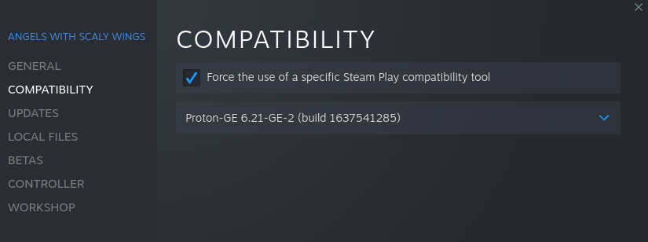
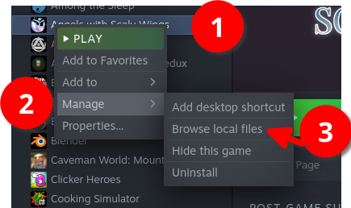

# The AI-enhanced universe of Angels with Scaly Wings!

I'm working on a mod called Endless AWSW that will mix the normal AWSW game with AI-generated prompts and stories. It's likely going to be not as good as the "real story" but if you're like me (can't get enough of the game) then you will get more of your dragon friends in their dragon world.

## Installation

### From source

This tutorial will bring the EAWSW mod to Angels with Scaly Wings. The tutorial focusses on Steam, but it should work with others too.

- **Note for Linux users! (Windows users can ignore this)**: To use mods from Steam workshop, set "force compatibility" to Proton in the properties window.

    


1. Download [the source from Github](https://github.com/peterwilli/Endless-AWSW/archive/refs/heads/main.zip).
2. Extract the downloaded source.
3. Download the [MagmaLink mod](https://steamcommunity.com/sharedfiles/filedetails/?id=2594080243) from the Steam workshop.
4. Find the location of your AWSW installation:
    1. On Steam, you can right-click your game and click "Browse local files"
    
5. Once you opened the folder, browse to `game/mods`-folder. Inside the source you extracted in step 1, you find the `EndlessAWSWClient`-folder. Drop this folder inside the `mods`-folder.
    1. Your final directory should look like this (depending on how many mods you installed, this may vary, as long as you got ~3 subdirectories, where one is called `EndlessAWSWClient` it should be fine):
        ```
        mods/
        |-- 2594080243
        |-- 2665734102
        |-- EndlessAWSWClient
        `-- core
        ```

## How to play!

1. Open the game on Steam.
2. Click "Start" and if you played the game already then make sure to click "no" when the system asks you to skip ahead. You can skip using tab if you like.
3. At some point, Zhong comes along and asks you if you want to play endless or normal mode (it happens the moment Sebastian greets you at your house).
4. Click endless if you want to try this mod, click normal if you want the game to progress as usual.
5. Once you're in endless mode, you can choose a server.
    1. For most people, the public server is fine, I'm hosting it for free, and it should be fast enough, depending on how many players are simultaneously playing.
    2. If you wish to install your own server, go to [Installing your own server](Installing%20your%20own%20server.md).
6. From here you can select a narrative, and you can type any reply and the dragons will reply in return. Have fun!  

If you want to help out, please [ping me on my Discord](https://discord.gg/gKcb5U3) (You can also DM me at EmeraldOdin#1991 but sometimes change the name, so it's a gamble hehe)

## Todo & Bugs

- [x] Prevent dragons from replying in a loop
- [x] You can send an empty message
- [x] Moving forward in story makes requests to the server (thanks 4onen!)
- [x] Fix RP bug: "Meet Lorem" works but "meet Lorem" doesn't
- [x] Make sure repeated texts are filtered out
- [x] Fix a bug I made a screenshot of
- [x] Teach AI to repeat itself less
- [x] Rp stuff: allow actions like "go into loremapt"
